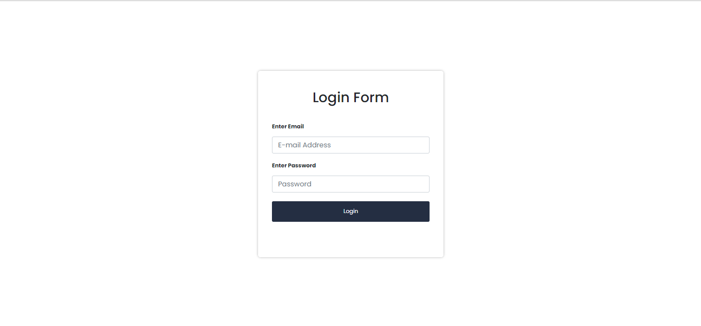
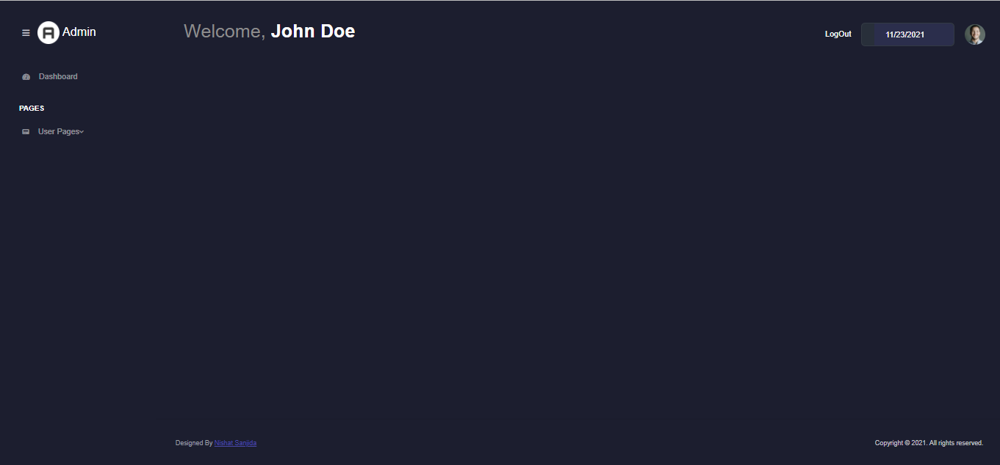

# **Dashboard-Template** 

Download the project into your local xampp/wampp folder and <strong>import the given SQL to phpmyadmin</strong> and then run the server.
  

  

> # **Login Form**

---  

 
 

> # **Dashboard Main Template**

---

 
 

> ### **Login Credentials**
| Key | Value |
| --- | ----------- |
| Email | admin@gmail.com |
| password | 12345 |

